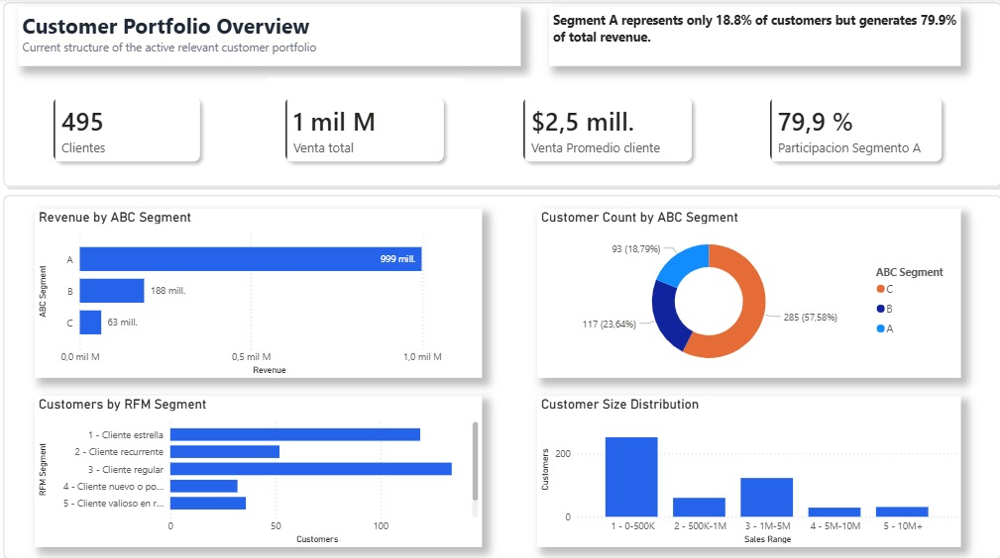
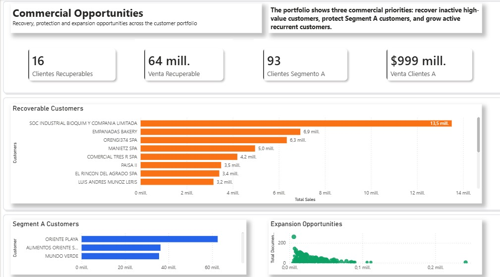

# Customer Portfolio Analysis & Commercial Opportunities

## Project Overview

This project analyzes an active customer portfolio from a distribution company using transaction-level sales data between 2024 and 2026.

The objective is not only to describe customer behavior, but also to identify commercial opportunities through customer segmentation, revenue concentration analysis, portfolio health assessment, and recovery opportunities.

The analysis combines customer classification techniques such as ABC segmentation and RFM analysis with interactive dashboards built in Power BI to support business decision-making.

---

## Business Context

The company serves hundreds of business customers with different purchasing behaviors and revenue contributions.

A common challenge in customer portfolio management is understanding:

- Which customers generate most of the revenue
- How concentrated the business is
- Which customers are most valuable
- Which customers are at risk of inactivity
- Which inactive customers could be recovered
- Which active customers have growth potential

This project aims to answer those questions through a structured customer analytics workflow.

---

## Objectives

### Portfolio Analysis

- Evaluate the structure of the active customer portfolio
- Measure revenue concentration
- Classify customers using ABC segmentation
- Analyze customer behavior using RFM methodology
- Understand customer size distribution

### Commercial Opportunity Detection

- Identify high-value inactive customers
- Estimate recoverable revenue
- Detect strategic Segment A customers
- Identify expansion opportunities among active recurring customers

---

## Methodology

### 1. Data Preparation

Sales transaction data was cleaned and transformed using Python.

Main preparation steps:

- Data type standardization
- Date conversion
- Text normalization
- Customer consolidation
- Revenue calculations
- Portfolio filtering

---

### 2. Active Relevant Customer Definition

To focus on the current state of the business, a customer relevance framework was created.

Customers were classified as active relevant customers when they met at least one of the following criteria:

- Purchased within the last 120 days
- Maintained recurring purchasing activity
- Represented significant revenue despite lower purchase frequency

This approach removes occasional or historical noise while preserving strategically important customers.

---

### 3. Customer Segmentation

#### ABC Segmentation

Customers were ranked according to revenue contribution.

Segments:

- A → Highest revenue contribution
- B → Medium revenue contribution
- C → Lower revenue contribution

#### RFM Segmentation

Customers were scored according to:

- Recency
- Frequency
- Monetary Value

Resulting segments include:

- Customer Star
- Recurring Customer
- Regular Customer
- New or Low Frequency Customer
- Valuable Customer at Risk
- Inactive or Lost Customer

---

### 4. Commercial Profiling

Additional business-oriented profiles were created:

- Active Recurring
- Active Recurring High Value
- High Value Inactive

These profiles were later used to identify growth and recovery opportunities.

---

## Dashboard Structure

### Page 1 — Customer Portfolio Overview

Provides a complete overview of the active customer portfolio.

**Key Questions Answered**

- How many active relevant customers exist?
- How concentrated is revenue?
- How is the customer base distributed?
- What is the current portfolio health?

**Visualizations**

- Revenue by ABC Segment
- Customer Count by ABC Segment
- Customers by RFM Segment
- Customer Size Distribution

**KPIs**

- Active Relevant Customers
- Total Revenue
- Average Revenue per Customer
- Segment A Revenue Share

---

### Page 2 — Commercial Opportunities

Focuses on actionable commercial insights.

**Key Questions Answered**

- Which customers should be recovered?
- Which customers should be protected?
- Which customers have growth potential?

**Visualizations**

- High Value Inactive Customers
- Top Segment A Customers
- Expansion Opportunities

**KPIs**

- Recoverable Customers
- Recoverable Revenue
- Segment A Customers
- Segment A Revenue

---

## Key Findings

### Revenue Concentration

Only **18.8%** of customers belong to Segment A, yet they generate approximately **79.9%** of total revenue.

This highlights a strong revenue concentration within a relatively small group of strategic customers.

### Recovery Opportunity

A total of **16 inactive high-value customers** were identified.

These customers represent approximately **CLP 64 Million** in recoverable revenue.

### Strategic Customers

A limited group of customers drives a substantial share of company revenue, making customer retention and relationship management critical.

### Growth Opportunity

A group of active recurring customers purchases frequently but has not yet reached high-value status.

These customers represent potential targets for:

- Upselling
- Cross-selling
- Product expansion initiatives

---

## Tools Used

### Python

- pandas
- numpy
- matplotlib
- pathlib

### Power BI

- Data Modeling
- DAX Measures
- Interactive Dashboards
- Business KPI Design

---

## Repository Structure

```text
customer-portfolio-analysis/
│
├── notebook/
│   └── customer_portfolio_analysis.ipynb
│
├── images/
│   ├── dashboard_page1.jpeg
│   ├── dashboard_page2.jpeg
│
├── README.md
│
└── requirements.txt
```

---

## Dashboard Preview

### Customer Portfolio Overview



### Commercial Opportunities



---

## Business Value

This project demonstrates how transaction-level sales data can be transformed into actionable business intelligence.

By combining customer segmentation techniques with commercial opportunity analysis, the resulting dashboard helps decision-makers:

- Understand customer portfolio health
- Monitor revenue concentration
- Prioritize customer retention efforts
- Identify revenue recovery opportunities
- Target customers with growth potential

---

## Author

**Bastián Seura**

Data Analytics | Business Intelligence | Customer Analytics

**LinkedIn**  
https://www.linkedin.com/in/bastian-seura

**GitHub**  
https://github.com/bastianseura
